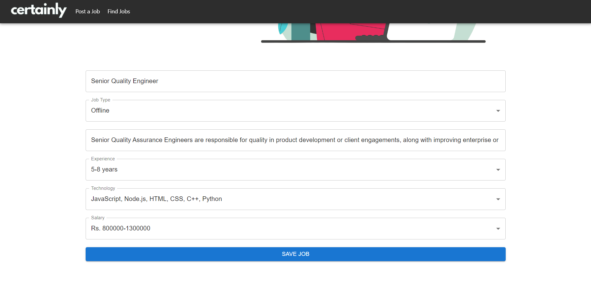
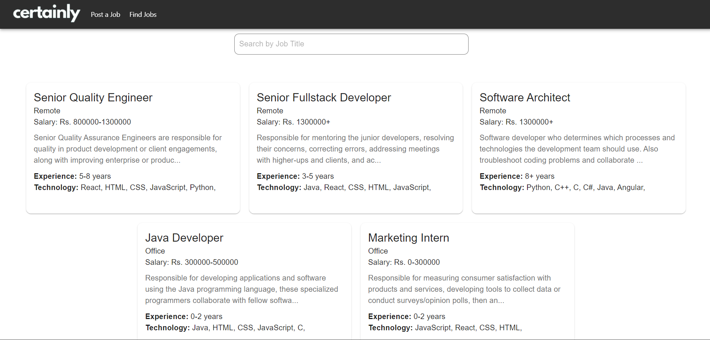

# Certainly 💼

Certainly is a modern job seeker platform designed to simplify and streamline the job search experience. Built using a MERN-like stack with a React frontend and Node.js backend, Certainly aims to deliver a clean, fast, and intuitive interface for job discovery and posting.

---

## 🚀 Features

- 🌐 Job listing and search UI
- 📝 Post job opportunities
- 🧠 Smart form validations
- 📦 MongoDB database integration
- ⚛️ React-based frontend with reusable components
- 🔧 Express.js backend with API routing
- 🎨 Responsive UI built with CSS

---

## 🛠 Tech Stack

- **Frontend**: React, JSX, CSS
- **Backend**: Node.js, Express.js
- **Database**: MongoDB Atlas
- **Version Control**: Git + GitHub

---

## 📁 Project Structure

```
Certainly/
├── client/ # React frontend
│ ├── public/ # Static assets
│ ├── src/ # React source code
│ │ ├── assets/
│ │ ├── components/
│ │ ├── pages/
│ │ ├── routes/
│ │ └── services/
│ ├── App.js
│ ├── index.js
│ └── ...
│
├── server/ # Node.js + Express backend
│ ├── bin/
│ ├── models/
│ ├── routes/
│ ├── views/
│ ├── app.js
│ └── ...
│
├── .gitignore
├── README.md
```

---

## 🧪 Getting Started

To run the project locally, follow these steps:

### 1. Clone the repository

```bash
git clone https://github.com/zShankie/Certainly.git
cd Certainly
```

### 2. Install client dependencies and start React app

```bash
cd client
npm install
npm start
```

### 3. Install server dependencies and start backend server

```bash
cd server
npm install
npm run dev
```

📝 Note: Make sure to create a .env file in the server/ directory based on the .env.example provided.

## 📸 Screenshots

### Home Page


### Create Job Page


### Job Post Form Filled



### Job Listings Page


